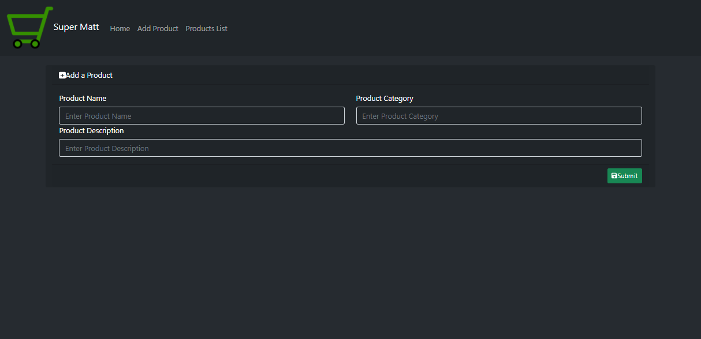

# Project Name: SUPER MATT

## Project Description

Super Matt is Java - SringBoot MVC CRUD Application that uses a ReactJS user interface to perform simple CRUD processes of a supermarket inventory.

## Setup Instructions

### Backend

The backend of this project uses the Java programming language. To implement and run the project locally, the following are the step to step setup instructions:

- Use the STS IDE to import the clone of this project as a Maven Project. - Update the Maven Projct to have all required packages installed as jars.

- Check the pom.xml file to ensure you have the "spring-boot-starter-web", the "spring-boot-starter-data-jpa" and apache-derby dependancy.

- Run the simple test class provided by SpringBoot to have the application return the string "Hi" on the URL http://localhost:8080/hello

            import org.springframework.web.bind.annotation.RequestMapping;
            import org.springframework.web.bind.annotation.RestController;

            @RestController //Annotation to notify that this is a Spring Application
            public class HelloController {

                    @RequestMapping("/hello") //Annotation for the GET method to indicate the routing path
                    public String sayHi() {

  return "Hi";
  }
  }

- If everything up this point seems fine run the application and test the api endpoint http://localhost:8080/products/ using postman to POST, GET, UPDATE and DELETE dummy data.

### Frontend

ReactJS was used to build the user interface for the web application to handle the view layer. Reactjs makes dynamic web pages and also allows for reusable components. To set the frontend of this application:

- After creating my API usind spring boot on the main folder, create a webapp folder cd into it and run: - npx-react-app supermatt-frontend - npm install react-bootstrap bootstrap - npm install --save react-router-dom - npm i --save @fortawesome/fontawesome-svg-core - npm install --save @fortawesome/free-solid-svg-icons - npm install --save @fortawesome/react-fontawesome - npm install axios
- Alternatively clone the repo and run npm install to install all required dependancies described on the package.json file.

## BDD

Using the services on the application, the idea is to have clients able to add new products to the inventory, update existing items, delete exising items and view all products in the inventory.

### APIs

The development of APIs applies the Richardson Maturity Model to measure level RESTfulness which includes

- Level 3 - Applies the Haetous model using the rel and href attributes.
- Level 2 - Applies status codes.
- Level 1 - Individual URI for each resource.
- Level 0 - Not RESTful.

The decisons made about the API aims to accomplish easy deployment of APIs, Scaling, Flexibility and Technology agnosticity. Some of the features are as follows:

#### GET

In JAX-RS the GET method could either return an XML or JSON data formats. The annotation for this output is the @XMLRootElement.

#### POST

- To consume data from the API the annotation @Consumes specifies the expected request body format which in this case is included in the header requirements as the ContentType which is indicated as application/json.

### Data

Ordinarily the data should come into the queue from a JBBC database however in the interest of accomplishing the logic of the services in this project, an Apache Derby Database is used which refreshs to null on each deployment.

### Future Modifications

- A relational POSTGRESQL Database will be introduced.
- Implement API metadata headers that allows for authentication using objects such as API Keys, also incude Cookies in the metadata to increase API fetch efficiency

## Technologies, Libraries and Frameworks Used

        - Java
        - Spring Framework
        - SpringBoot Web MVC
        - Spring Data JPA (Java Persistence API)
        - Maven to manage backend dependancies.
        - Apache Derby
        - React Javascript

### LICENSE: [MIT LICENSE](https://raw.githubusercontent.com/deepeters/simple-supermatt/master/LICENSE)
